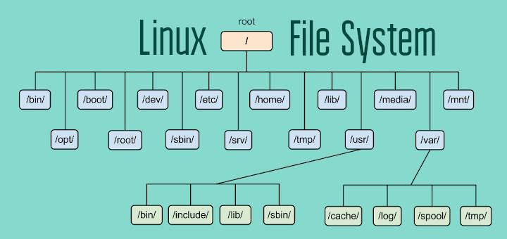

# Day 1 - Linux Basics

## 📁 File System Hierarchy

* / → Root directory
* /home → User files
* /etc → Configuration files
* /var → Logs and variable data



### Also the use of each directory can be understood by the following image:


---

## 📂 Navigation Commands

### pwd

Shows current directory

```bash
pwd
```

### ls

Lists files

```bash
ls -l
ls -a
```

### cd

Change directory

```bash
cd /home
cd ..
```

---

## 📄 File Operations

### cp

```bash
cp file1 file2
```

### mv

```bash
mv file1 file2
```

### rm

```bash
rm file.txt
```

---

## 🔍 Search Commands

### grep

```bash
grep "text" file.txt
```

### find

```bash
find . -name "*.txt"
```
